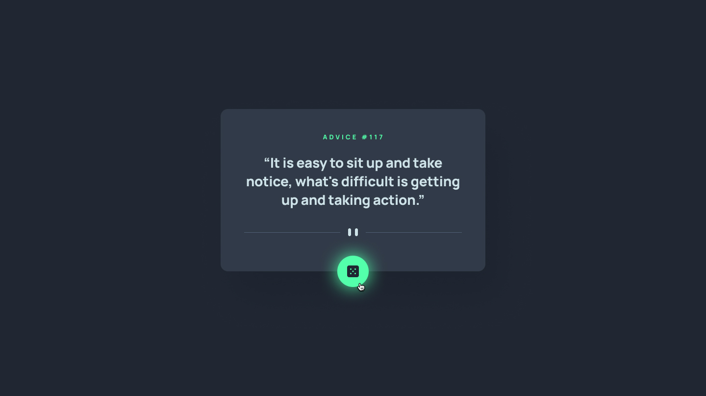
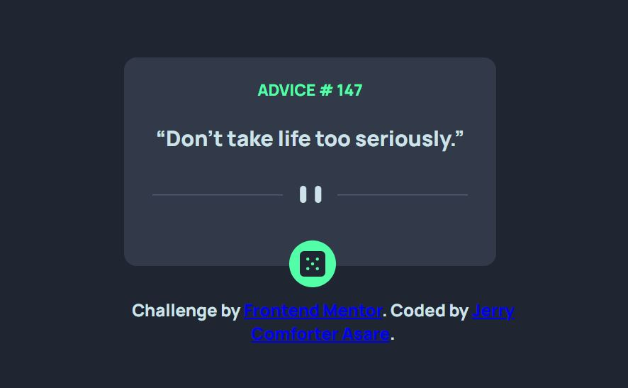
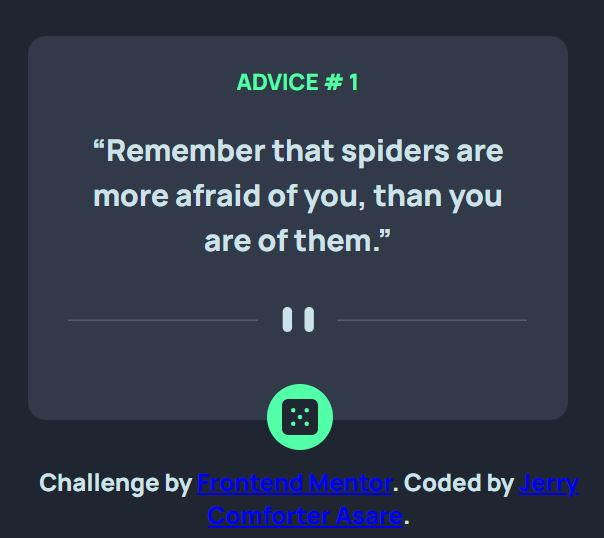

# Frontend Mentor - Advice generator app solution

This is a solution to the [Advice generator app challenge on Frontend Mentor](https://www.frontendmentor.io/challenges/advice-generator-app-QdUG-13db). Frontend Mentor challenges help you improve your coding skills by building realistic projects.

## Table of contents

- [Overview](#overview)
  - [The challenge](#the-challenge)
  - [Screenshot](#screenshot)
  - [Links](#links)
- [My process](#my-process)
  - [Built with](#built-with)
  - [What I learned](#what-i-learned)
  - [Continued development](#continued-development)
  - [Useful resources](#useful-resources)
- [Author](#author)
- [Acknowledgments](#acknowledgments)


## Overview

### The challenge

Users should be able to:

- View the optimal layout for the app depending on their device's screen size
- See hover states for all interactive elements on the page
- Generate a new piece of advice by clicking the dice icon

### Screenshot






### Links

- Solution URL: [Repo](https://github.com/jcasare/FrontEndChallenges-advice-generator)
- Live Site URL: [Live Site](https://jcasare.github.io/FrontEndChallenges-advice-generator/)

## My process

### Built with

- Semantic HTML5 markup
- CSS custom properties
- Flexbox
- Mobile-first workflow
- JavaScript
- [Axios](https://axios-http.com/) - JS library


### What I learned

I learnt on how to use Axios to get API data

```
```js
const adviceGenerate = async () => {
  try{
    const response = await axios.get(apiLink);
    let data = response.data;
}
catch(error){
  console.log(error);
}
```

### Continued development

I'll like to continue learning much more on alternative ways to get data from API with the goal of ultimately finding out that I'll find best fit.

### Useful resources

- [async and await](https://developer.mozilla.org/en-US/docs/Learn/JavaScript/Asynchronous/Promises) - This helped me understand how the async and await helps with promises

## Author

- LinkedIn - Jerry Comforter Asare](https://linkedin.com/in/jerry-asare-comforter/)
- Frontend Mentor - [@jcasare](https://www.frontendmentor.io/profile/jcasare)
- Twitter - [@vhybesofficial](https://www.twitter.com/vhybesofficial)

## Acknowledgments

I'd like to thank Angela Yu for her wonderful training....and also to Frontend Mentor for these challenges.

